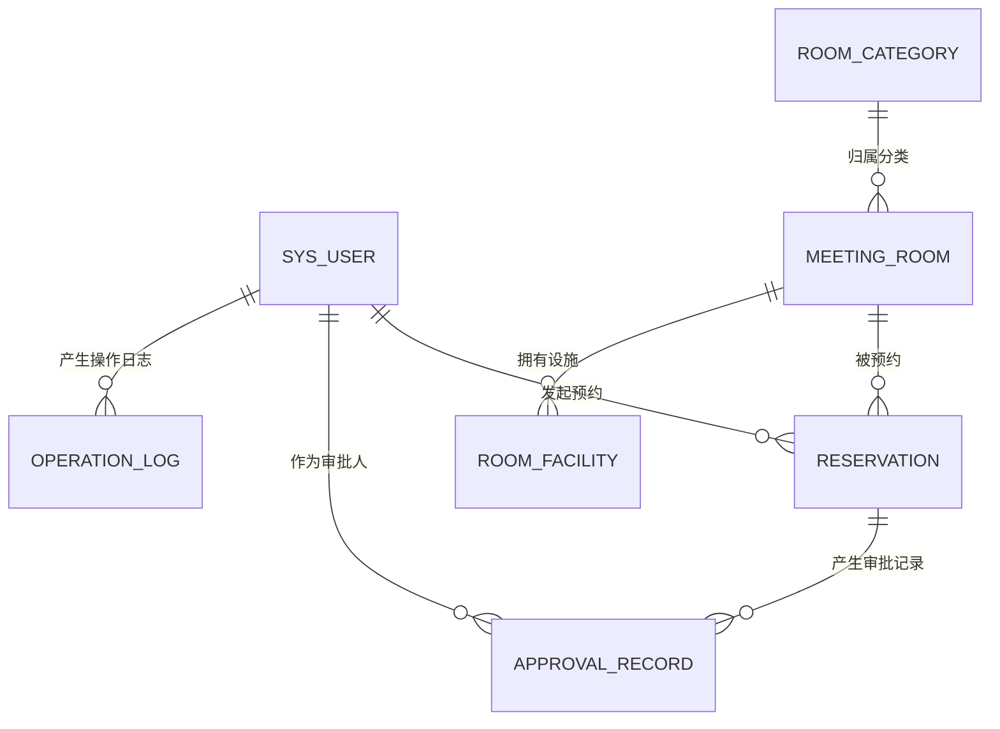
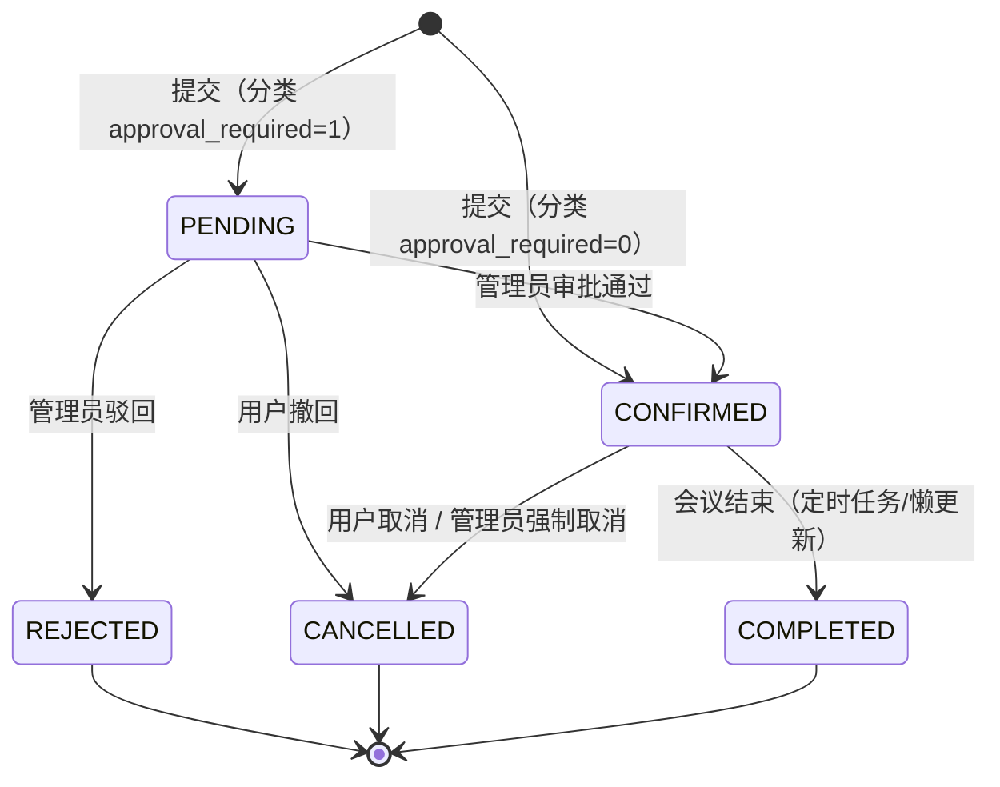

# 会议室预约与时间冲突检查系统 · 数据库设计冻结文档

| 项 | 内容 |
| --- | --- |
| 文档版本 | v1.0 |
| 冻结状态 | **Database Schema Freeze: READY** |
| 冻结日期 | 2026-09-09 |
| 目标环境 | MySQL 8.x · InnoDB · utf8mb4 · 本地开发 127.0.0.1:3306 |
| 配套产物 | `sql/schema.sql`（建表）、`sql/data.sql`（初始化数据） |
| 阶段范围 | 仅数据库建模与冻结。不含 Controller / Service / Mapper / Entity / 前端对接 / 登录认证实现 |

> 本文档是后续 Spring Boot + MyBatis 开发的**唯一数据库基线**。改表先改本文档，再改 SQL，再动代码。

---

## 1. 数据库设计目标

1. **支撑已确定的业务规则**：会议室预约、时间冲突检测、基于分类的差异化审批。
2. **规范、清晰、可解释**：每张表职责唯一，字段能对上业务名词，能在答辩/实训验收时讲清楚。
3. **克制**：7 张核心表，不做 RBAC 权限树、部门组织架构、消息中心、工作流引擎、事件溯源。
4. **面向实现**：表结构与索引直接为 Spring Boot + MyBatis 服务，避免联表地狱和过度抽象。
5. **事实不冗余**：同一业务事实只存一处（如审批时间只存 `approval_record.created_at`）。

---

## 2. 最终表清单

| # | 表名 | 职责一句话 | 核心关系 |
| --- | --- | --- | --- |
| 1 | `sys_user` | 登录账号与角色（USER/ADMIN） | 发起预约、执行审批、产生日志 |
| 2 | `room_category` | 会议室类型 + 预约规则（审批开关在分类上） | 1:N 会议室 |
| 3 | `meeting_room` | 具体会议室资源（A301、B502…） | 属于分类；被预约；拥有设施 |
| 4 | `room_facility` | 会议室设施明细（投影仪、白板…） | 属于会议室 |
| 5 | `reservation` | 预约单（核心业务表，含状态机） | 属于会议室与预约人；产生审批记录 |
| 6 | `approval_record` | 审批行为历史（谁、何时、通过/驳回） | 属于预约与审批人 |
| 7 | `operation_log` | 关键管理行为日志 | 属于操作人 |

### 2.1 相对最初清单 / ER 草图的调整说明

| 调整 | 原因 |
| --- | --- |
| **不建** `reservation_attendee`（预约参与人表，ER 草图中出现） | 当前需求只有“参与人数 `participant_count`”，没有选人、邀请、签到功能。参与人是预约与用户的 N:M 关系，为不存在的功能维护一张关联表属于过度设计。将来若新增“参与人报名”，再加表即可，`reservation` 无需改动。 |
| `room_facility` **不拆** `facility` 字典表 + 关系表 | 设施是封闭小集合（投影仪/白板/视频会议设备/麦克风），没有独立的设施管理页面需求。拆两张表只换来“名称规范化”，课程规模下收益为零，反而多一次 JOIN。 |
| `meeting_room` **不设** `floor` 字段（ER 草图中有） | `location`（楼栋+楼层）已覆盖该信息，两个字段表达同一事实会互相矛盾。 |
| `reservation` **新增** `reservation_no` | 对外展示的业务单号（RSV+日期+序号），用于列表展示、追溯、日志引用，避免暴露自增主键；成本仅一个唯一索引。 |
| `reservation` **新增** `cancel_reason` | `CANCELLED` 需要区分“用户主动取消”与“管理员强制取消（处理异常预约）”，两者都是明确需求；`remark` 是申请人提交时的备注，语义不同，不能混用。 |
| `reservation` **不加** `version` | 并发冲突走“事务 + 会议室行锁 + 条件 UPDATE”（见第 11 节），乐观锁对本项目收益低且增加 MyBatis 更新模板复杂度。 |
| `reservation` **不加** `deleted` | 预约不允许物理删除，生命周期完全由 `status` 表达（取消即 `CANCELLED`），逻辑删除位没有业务入口。 |
| `reservation` **不加** `approved_at` | 审批时间是“审批行为”的事实，唯一事实源是 `approval_record.created_at`；冗余一份违反“不重复存储相同业务事实”，展示时 JOIN 即可。 |

---

## 3. ER 关系



| 关系 | 类型 | 落库方式（外键） | 说明 |
| --- | --- | --- | --- |
| `sys_user` : `reservation` | **1:N** | `reservation.user_id` | 一个用户可发起多条预约；一条预约只属于一个预约人 |
| `room_category` : `meeting_room` | **1:N** | `meeting_room.category_id` | 一个分类下有多间会议室；一间会议室只属一个分类 |
| `meeting_room` : `reservation` | **1:N** | `reservation.room_id` | 一间会议室历史上有多条预约；同一时刻的占用由时间冲突规则保证互斥（不是数据库约束） |
| `meeting_room` : `room_facility` | **1:N** | `room_facility.room_id` | 一间会议室有多条设施记录 |
| `reservation` : `approval_record` | **1:N** | `approval_record.reservation_id` | 一条预约可有多条审批历史；当前流程（无重新提交）实际最多 1 条，表结构保留多条能力 |
| `sys_user` : `approval_record` | **1:N** | `approval_record.approver_id` | 管理员作为审批人处理多条预约 |
| `sys_user` : `operation_log` | **1:N** | `operation_log.user_id` | 一个操作人产生多条日志 |

补充说明：

- `room_category` 与 `reservation` **没有直接外键**：预约规则通过 `meeting_room.category_id` 间接关联，避免同一事实两条通路。
- `reservation` 与 `sys_user` 之间**不建参与人 N:M 关系**（见 2.1）。

---

## 4. 各表职责

| 表 | 只负责 | 明确不负责 |
| --- | --- | --- |
| `sys_user` | 身份认证数据、角色 | 权限点配置（无 RBAC）、部门归属 |
| `room_category` | 会议室**类型**与**预约规则**（是否审批、最长时长、提前天数、人数区间） | 具体某间会议室的属性 |
| `meeting_room` | 具体会议室的**资源属性**（名称、位置、实际容量、可用状态） | 预约规则（规则在分类上） |
| `room_facility` | 会议室设施明细 | 设施预约/借用流程 |
| `reservation` | 预约单生命周期（时间、人数、状态、取消原因） | 审批过程细节（在 `approval_record`） |
| `approval_record` | 审批行为历史 | 当前审批状态（看 `reservation.status`，本表只记历史） |
| `operation_log` | 关键管理行为留痕 | 普通 HTTP 访问日志、用户操作埋点 |

---

## 5. 完整字段定义

### 5.1 sys_user（系统用户表）

| 字段 | 类型 | 空 | 默认 | 说明 |
| --- | --- | --- | --- | --- |
| id | BIGINT | 否 | 自增 | 主键 |
| username | VARCHAR(50) | 否 | — | 登录名，唯一 |
| password | VARCHAR(100) | 否 | — | 演示阶段明文；接入认证后存 BCrypt 摘要 |
| real_name | VARCHAR(50) | 否 | — | 真实姓名 |
| email | VARCHAR(100) | 是 | NULL | 邮箱 |
| phone | VARCHAR(20) | 是 | NULL | 手机号 |
| role | VARCHAR(20) | 否 | 'USER' | `USER` 普通用户 / `ADMIN` 管理员 |
| status | TINYINT | 否 | 1 | 1 正常 / 0 禁用（只禁用不删除） |
| created_at / updated_at | DATETIME | 否 | CURRENT_TIMESTAMP | 创建/更新时间（`updated_at` 随更新自动刷新） |

### 5.2 room_category（会议室分类表：类型与预约规则）

| 字段 | 类型 | 空 | 默认 | 说明 |
| --- | --- | --- | --- | --- |
| id | BIGINT | 否 | 自增 | 主键 |
| category_name | VARCHAR(50) | 否 | — | 唯一。小型会议室 / 普通会议室 / 大型会议室 / 特殊会议室 |
| min_capacity | INT | 否 | — | 分类容量下限（人） |
| max_capacity | INT | 否 | — | 分类容量上限（人） |
| approval_required | TINYINT | 否 | 0 | **审批开关（本设计的核心配置点）**：1 提交后 `PENDING`，管理员审批；0 提交后直接 `CONFIRMED` |
| max_duration_minutes | INT | 否 | 240 | 单次预约最大时长（分钟），Service 校验 |
| advance_days | INT | 否 | 7 | 允许提前预约的最大天数，Service 校验 |
| description | VARCHAR(500) | 是 | NULL | 分类说明 |
| created_at / updated_at | DATETIME | 否 | CURRENT_TIMESTAMP | 同上 |

### 5.3 meeting_room（会议室表：具体资源）

| 字段 | 类型 | 空 | 默认 | 说明 |
| --- | --- | --- | --- | --- |
| id | BIGINT | 否 | 自增 | 主键 |
| category_id | BIGINT | 否 | — | 外键 → `room_category.id`，决定该会议室走哪套预约规则 |
| room_name | VARCHAR(50) | 否 | — | 唯一。资源自然标识（A301、B502），防重复建档 |
| location | VARCHAR(100) | 是 | NULL | 楼栋+楼层 |
| capacity | INT | 否 | — | **实际容纳人数（真实资源属性）**，预约人数校验以此为准 |
| status | TINYINT | 否 | 1 | 1 可用 / 0 维护中 / 2 停用；预约时要求 =1 |
| description | VARCHAR(500) | 是 | NULL | 说明 |
| created_at / updated_at | DATETIME | 否 | CURRENT_TIMESTAMP | 同上 |

**`capacity` 与分类人数区间的关系（职责冻结）：**

- `capacity`（会议室）= **事实**：这个房间实际能坐多少人。预约校验 `participant_count ≤ meeting_room.capacity` 以它为准。
- `[min_capacity, max_capacity]`（分类）= **规则/规划**：这一类房间的人数定位，用于列表筛选和管理员建档时的合理性校验。
- **是否允许超范围：默认不允许。** 管理员创建/修改会议室时由 Service 校验 `capacity ∈ [min_capacity, max_capacity]`，不满足应调整分类区间或更换分类，而不是把脏数据放进库。数据库层不做跨表 CHECK（MySQL CHECK 无法引用其他表），该约束落在应用层并写入接口文档。
- **规则字段 vs 资源属性的边界**：`approval_required`、`max_duration_minutes`、`advance_days`、`min/max_capacity` 属于分类（规则）；`room_name`、`location`、`capacity`、`status`、`description`、设施属于会议室（资源）。同一信息只出现在一侧。

### 5.4 room_facility（会议室设施表）

| 字段 | 类型 | 空 | 默认 | 说明 |
| --- | --- | --- | --- | --- |
| id | BIGINT | 否 | 自增 | 主键 |
| room_id | BIGINT | 否 | — | 外键 → `meeting_room.id` |
| facility_name | VARCHAR(50) | 否 | — | 投影仪 / 白板 / 视频会议设备 / 麦克风等 |
| quantity | INT | 否 | 1 | 数量 |
| description | VARCHAR(200) | 是 | NULL | 设施说明 |

唯一约束 `uk_room_facility(room_id, facility_name)` 防止同一会议室重复登记同名设施；其最左前缀同时充当“按会议室查设施”的普通索引。

### 5.5 reservation（预约表，核心业务表）

| 字段 | 类型 | 空 | 默认 | 说明 |
| --- | --- | --- | --- | --- |
| id | BIGINT | 否 | 自增 | 主键 |
| reservation_no | VARCHAR(32) | 否 | — | 唯一。业务单号，服务端按 `RSV+日期+序号` 生成 |
| room_id | BIGINT | 否 | — | 外键 → `meeting_room.id` |
| user_id | BIGINT | 否 | — | 外键 → `sys_user.id`，预约人 |
| title | VARCHAR(100) | 否 | — | 会议主题 |
| start_time | DATETIME | 否 | — | 开始时间 |
| end_time | DATETIME | 否 | — | 结束时间；CHECK 约束 `end_time > start_time` 兜底 |
| participant_count | INT | 否 | 1 | 参与人数，校验对象是会议室实际容量 `capacity` |
| status | VARCHAR(20) | 否 | —（无默认值） | 状态机：`PENDING` / `CONFIRMED` / `REJECTED` / `CANCELLED` / `COMPLETED`。**不设 DB 默认值**：初始状态由分类的 `approval_required` 决定，是业务决策，不是存储默认值 |
| remark | VARCHAR(500) | 是 | NULL | 申请人备注 |
| cancel_reason | VARCHAR(500) | 是 | NULL | 取消原因：用户取消 / 管理员强制取消时填写 |
| created_at / updated_at | DATETIME | 否 | CURRENT_TIMESTAMP | 同上 |

**候选字段的取舍结论**：`reservation_no` 保留（追溯展示）；`cancel_reason` 保留（取消语义必需）；`version`、`deleted`、`approved_at` 均不保留（理由见 2.1）。

### 5.6 approval_record（审批记录表）

| 字段 | 类型 | 空 | 默认 | 说明 |
| --- | --- | --- | --- | --- |
| id | BIGINT | 否 | 自增 | 主键 |
| reservation_id | BIGINT | 否 | — | 外键 → `reservation.id` |
| approver_id | BIGINT | 否 | — | 外键 → `sys_user.id`，审批管理员 |
| action | VARCHAR(20) | 否 | — | `APPROVE` 通过 / `REJECT` 驳回 |
| remark | VARCHAR(500) | 是 | NULL | 审批意见（驳回时应用层要求必填） |
| created_at | DATETIME | 否 | CURRENT_TIMESTAMP | 审批时间（审批时间的唯一事实源） |

### 5.7 operation_log（操作日志表）

| 字段 | 类型 | 空 | 默认 | 说明 |
| --- | --- | --- | --- | --- |
| id | BIGINT | 否 | 自增 | 主键 |
| user_id | BIGINT | 否 | — | 外键 → `sys_user.id`，操作人 |
| operation_type | VARCHAR(50) | 否 | — | `APPROVE_RESERVATION` / `REJECT_RESERVATION` / `FORCE_CANCEL_RESERVATION` / `CREATE_ROOM` / `UPDATE_ROOM` / `UPDATE_CATEGORY` 等，可扩展 |
| business_type | VARCHAR(50) | 否 | — | `RESERVATION` / `MEETING_ROOM` / `ROOM_CATEGORY` |
| business_id | BIGINT | 否 | — | 关联业务主键 |
| content | VARCHAR(500) | 否 | — | 操作内容描述（人可读） |
| ip_address | VARCHAR(50) | 是 | NULL | 操作 IP |
| created_at | DATETIME | 否 | CURRENT_TIMESTAMP | 操作时间；日志只增不改，**不设 `updated_at`** |

---

## 6. 主外键设计

- **主键**：全部为 `BIGINT AUTO_INCREMENT`，与 MyBatis `useGeneratedKeys` 直接配合。
- **外键**（共 7 个，均建物理外键约束，课程项目以“规范可解释”优先）：

| 外键约束名 | 子表.字段 | 父表.字段 |
| --- | --- | --- |
| fk_room_category | meeting_room.category_id | room_category.id |
| fk_facility_room | room_facility.room_id | meeting_room.id |
| fk_reservation_room | reservation.room_id | meeting_room.id |
| fk_reservation_user | reservation.user_id | sys_user.id |
| fk_approval_reservation | approval_record.reservation_id | reservation.id |
| fk_approval_approver | approval_record.approver_id | sys_user.id |
| fk_log_user | operation_log.user_id | sys_user.id |

- 建表顺序即外键依赖顺序：`sys_user → room_category → meeting_room → room_facility → reservation → approval_record → operation_log`。
- 用户只禁用不删除、预约只改状态不删除，因此所有外键引用不会被悬空；不需要 `ON DELETE` 级联策略。

---

## 7. 预约状态机（冻结）

状态集合：`PENDING` / `CONFIRMED` / `REJECTED` / `CANCELLED` / `COMPLETED`。**结论：5 个状态足够，不引入 `APPROVED` 等同义状态。**



| 当前状态 | 事件 | 目标状态 | 操作者与记录 |
| --- | --- | --- | --- |
| —（创建） | 提交预约，分类免审批 | `CONFIRMED` | 用户；通过全部合法性校验 + 无时间冲突 |
| —（创建） | 提交预约，分类需审批 | `PENDING` | 同上；进入待审批 |
| `PENDING` | 审批通过 | `CONFIRMED` | 管理员；写 `approval_record(APPROVE)` + `operation_log` |
| `PENDING` | 审批驳回 | `REJECTED`（终态） | 管理员；写 `approval_record(REJECT)` + `operation_log` |
| `PENDING` | 用户撤回 | `CANCELLED` | 用户；可填 `cancel_reason` |
| `CONFIRMED` | 用户取消（开始时间前） | `CANCELLED` | 用户；填 `cancel_reason` |
| `CONFIRMED` | 管理员强制取消（处理异常预约） | `CANCELLED` | 管理员；填 `cancel_reason` + `operation_log` |
| `CONFIRMED` | 会议结束 | `COMPLETED`（终态） | 系统定时任务或查询时懒更新 |
| `REJECTED` / `CANCELLED` / `COMPLETED` | 不可迁移 | — | 终态 |

补充约束：

- `PENDING` 与 `CONFIRMED` **都占用时间段**并参与冲突检测（审批期间锁段，避免审批通过后撞车）。
- 状态迁移在 SQL 层一律用**条件更新**保证原子性，例如审批通过：
  `UPDATE reservation SET status='CONFIRMED' WHERE id=? AND status='PENDING'`，影响行数=1 才算成功，天然防止重复审批和并发迁移。
- `COMPLETED` 的生成方式（定时任务 vs 懒更新）属于后端实现决策，不影响表结构。

---

## 8. 分类审批机制（冻结）

1. 是否需要审批由 `room_category.approval_required` 决定，**是分类级配置，不是会议室级、更不是预约级**。管理员修改分类配置即批量改变该类全部会议室的行为。
2. 流程：
   - 免审批分类：提交 → 校验（会议室可用、人数 ≤ capacity、时长 ≤ max_duration_minutes、提前量 ≤ advance_days、无冲突）→ 直接 `CONFIRMED`。
   - 受控分类：同上校验 → `PENDING` → 管理员在审批列表处理 → `CONFIRMED` / `REJECTED`。
3. 管理员的职责边界（对应需求第 7 条）：审批受控会议室预约、管理会议室、管理分类、处理异常预约（强制取消）、查看操作记录。**不审批普通免审批预约。**
4. `approval_record` 产生规则：
   - **只有受控分类的预约被管理员处理时产生**（`APPROVE` / `REJECT` 各一条）；
   - **普通会议室预约不产生任何审批记录**；
   - `PENDING` 状态下还没有审批记录，处理时才写入；
   - 表结构允许一个预约多条审批历史（无唯一约束），当前流程无“重新提交”，实际最多一条；将来若支持“驳回后修改重报”，无需改表。

---

## 9. 时间冲突规则（冻结）

对同一 `room_id`，若已存在满足以下条件的预约，则新预约**冲突**：

```sql
existing.status IN ('PENDING', 'CONFIRMED')
AND new_start < existing.end_time
AND new_end   > existing.start_time
```

等价的检测 SQL（后端 Mapper 直接使用）：

```sql
SELECT COUNT(*) FROM reservation
WHERE room_id   = #{roomId}
  AND status IN ('PENDING', 'CONFIRMED')
  AND start_time < #{proposedEnd}
  AND end_time   > #{proposedStart};
```

即**半开区间 `[start, end)` 求交**：首尾相接不冲突，任何重叠即冲突。`REJECTED`、`CANCELLED`、`COMPLETED` 不参与判断。

边界用例（已有预约 10:00–11:00，已在本机 MySQL 8.0.43 实测通过）：

| 新预约 | 判定 | 原因 |
| --- | --- | --- |
| 09:00–10:00 | 不冲突 | `new_end > existing.start` 不成立（端点相等不算重叠） |
| 11:00–12:00 | 不冲突 | `new_start < existing.end` 不成立 |
| 09:30–10:30 | **冲突** | 前部重叠 |
| 10:30–11:30 | **冲突** | 后部重叠 |
| 10:10–10:50 | **冲突** | 完全包含 |

实测输出：上述 5 例结果分别为 0 / 0 / 1 / 1 / 1；另验证压在 `REJECTED`、`CANCELLED` 预约上的时间段均返回 0。

与冲突检测配合的**预约合法性校验**（Service 层，同一事务内顺序执行）：`start_time < end_time`（DB 另有 CHECK 兜底）→ 会议室 `status=1` → `participant_count ≤ meeting_room.capacity` → 时长 ≤ 分类 `max_duration_minutes` → 提前量 ≤ 分类 `advance_days` → 时间冲突检测。

---

## 10. 索引设计（冻结）

| 表 | 索引 | 类型 | 用途 |
| --- | --- | --- | --- |
| 全部表 | `PRIMARY KEY(id)` | 唯一 | BIGINT 自增主键 |
| sys_user | `uk_user_username(username)` | 唯一 | 用户名唯一 + 登录等值查询 |
| room_category | `uk_category_name(category_name)` | 唯一 | 分类名唯一 |
| meeting_room | `uk_room_name(room_name)` | 唯一 | 会议室名称唯一（资源自然标识，命名含楼栋前缀，全局唯一防重复建档） |
| meeting_room | `idx_room_category(category_id)` | 普通 | 按分类列会议室 |
| room_facility | `uk_room_facility(room_id, facility_name)` | 唯一 | 防重复登记；最左前缀即“按会议室查设施” |
| reservation | `uk_reservation_no(reservation_no)` | 唯一 | 单号查预约 |
| reservation | `idx_reservation_room_status_start(room_id, status, start_time)` | 普通 | **时间冲突检测核心索引** |
| reservation | `idx_reservation_user_start(user_id, start_time)` | 普通 | “我的预约”按开始时间查询/排序 |
| approval_record | `idx_approval_reservation(reservation_id)` | 普通 | 预约详情带出审批历史 |
| approval_record | `idx_approval_approver(approver_id)` | 普通 | 审批人维度查询 |
| operation_log | `idx_log_user(user_id)` | 普通 | 按操作人查日志 |
| operation_log | `idx_log_business(business_type, business_id)` | 普通 | 按业务对象定位日志 |

### 10.1 冲突查询的索引分析（如实说明）

```sql
WHERE room_id = ?                       -- 等值
  AND status IN ('PENDING','CONFIRMED') -- IN（两分支）
  AND start_time < ?                    -- 区间条件 1
  AND end_time > ?                      -- 区间条件 2
```

- 采用组合索引 `idx_reservation_room_status_start(room_id, status, start_time)`：最左 `room_id` 等值定位，`status IN` 展开为两个分支，`start_time` 作范围扫描。候选集被缩小为“该会议室 + 活跃状态 + 开始时间早于新预约结束时间”的少数行。
- **`end_time > ?` 无法走索引**：B-Tree 只能对一个维度的区间定位，两个相互独立的不等式（start 与 end 求交）不可能同时被索引覆盖，剩余过滤在回表后完成。**因此不声称普通 B-Tree 能完全优化该查询**，它的作用是把候选集压到足够小。
- 实测（本机 MySQL 8.0.43，种子数据）：`EXPLAIN` 显示 `type=range`，`key=idx_reservation_room_status_start`，扫描约 2 行，`Extra: Using index condition; Using where`。课程规模下单会议室活跃预约通常在几十行以内，该方案完全够用。
- MySQL 没有 PostgreSQL 那样的排他约束（`EXCLUDE`），时间重叠**无法**纯靠索引杜绝，最终防线是第 11 节的并发控制。
- 不给 `status` 单独建索引：基数只有 5，选择性差，组合索引已覆盖。

---

## 11. 并发问题说明（本阶段只冻结方案，不实现）

**问题**：两个请求针对同一会议室同一时段并发提交时：

1. 请求 A 查询冲突 → 无冲突；
2. 请求 B 查询冲突 → 也无冲突（A 尚未 INSERT）；
3. A、B 先后 INSERT → 数据库中出现两条重叠的 `CONFIRMED` 预约。

普通 SELECT 无法防止这一点（第 10 节已说明索引不能表达排他约束）。后续方案对比：

| 方案 | 做法 | 评价 |
| --- | --- | --- |
| `@Transactional` + 事务内复查 | 提交方法加事务，插入前再查一次冲突 | 必要的基础，但单独使用仍挡不住并发窗口 |
| **悲观锁 / 会议室粒度锁（推荐）** | 事务内先 `SELECT id FROM meeting_room WHERE id=? FOR UPDATE`，把该会议室的预约写入串行化，再复查冲突、插入 | 锁粒度=单个会议室，不同会议室互不阻塞；实现简单、易讲解；注意统一“先锁会议室、再动预约”的加锁顺序即可避免死锁 |
| 提高事务隔离到 `SERIALIZABLE` | 全局串行化 | 代价覆盖全部业务，杀鸡用牛刀，不采用 |
| Redis 分布式锁 | 锁 `room:{id}` | 需要额外组件并引入锁续期/失效问题；**单实例课程项目没有必要**，多实例部署且数据库锁成为瓶颈时再引入 |
| 条件 UPDATE | 状态迁移一律 `UPDATE ... WHERE status=旧状态` | 作为第二道防线，防止重复审批/并发迁移，已写入第 7 节 |

**冻结结论**：后续实现采用 `Spring @Transactional` + 会议室行锁（`FOR UPDATE`）+ 事务内冲突复查 + 条件 UPDATE 的组合。本阶段不写任何实现代码。

---

## 12. 完整 DDL

以下与 `sql/schema.sql` 完全一致（以该文件为准），已在本机 MySQL 8.0.43 实际执行通过。

```sql
-- =============================================================================
-- 会议室预约与时间冲突检查系统 —— 数据库建表脚本
-- 目标数据库 : MySQL 8.x
-- 基线版本   : v1.0 (Database Schema Freeze, 2026-09-09)
-- 规范约定   : InnoDB / utf8mb4 / snake_case / BIGINT 主键 / DATETIME 时间
--              不使用 ENUM / 存储过程 / 触发器；状态机取值由应用层维护
-- =============================================================================

SET NAMES utf8mb4;

CREATE DATABASE IF NOT EXISTS meeting_room
  DEFAULT CHARACTER SET utf8mb4
  DEFAULT COLLATE utf8mb4_0900_ai_ci;

USE meeting_room;

-- 重建时按外键依赖逆序删表（首次执行可忽略）
DROP TABLE IF EXISTS operation_log;
DROP TABLE IF EXISTS approval_record;
DROP TABLE IF EXISTS reservation;
DROP TABLE IF EXISTS room_facility;
DROP TABLE IF EXISTS meeting_room;
DROP TABLE IF EXISTS room_category;
DROP TABLE IF EXISTS sys_user;

-- 1. sys_user 系统用户表
CREATE TABLE sys_user (
    id          BIGINT       NOT NULL AUTO_INCREMENT COMMENT '主键ID',
    username    VARCHAR(50)  NOT NULL                COMMENT '登录用户名（唯一）',
    password    VARCHAR(100) NOT NULL                COMMENT '登录密码（当前为演示明文，接入认证后改为BCrypt摘要）',
    real_name   VARCHAR(50)  NOT NULL                COMMENT '真实姓名',
    email       VARCHAR(100) NULL                    COMMENT '邮箱',
    phone       VARCHAR(20)  NULL                    COMMENT '手机号',
    role        VARCHAR(20)  NOT NULL DEFAULT 'USER' COMMENT '角色：USER-普通用户 / ADMIN-管理员',
    status      TINYINT      NOT NULL DEFAULT 1      COMMENT '账号状态：1-正常 0-禁用',
    created_at  DATETIME     NOT NULL DEFAULT CURRENT_TIMESTAMP COMMENT '创建时间',
    updated_at  DATETIME     NOT NULL DEFAULT CURRENT_TIMESTAMP ON UPDATE CURRENT_TIMESTAMP COMMENT '更新时间',
    PRIMARY KEY (id),
    UNIQUE KEY uk_user_username (username)
) ENGINE = InnoDB COMMENT = '系统用户表';

-- 2. room_category 会议室分类表（类型与预约规则）
CREATE TABLE room_category (
    id                   BIGINT       NOT NULL AUTO_INCREMENT COMMENT '主键ID',
    category_name        VARCHAR(50)  NOT NULL                COMMENT '分类名称（唯一）：小型会议室/普通会议室/大型会议室/特殊会议室',
    min_capacity         INT          NOT NULL                COMMENT '分类容量下限（人）',
    max_capacity         INT          NOT NULL                COMMENT '分类容量上限（人）',
    approval_required    TINYINT      NOT NULL DEFAULT 0      COMMENT '是否需要审批：1-是（提交后PENDING，管理员审批） 0-否（提交后直接CONFIRMED）',
    max_duration_minutes INT          NOT NULL DEFAULT 240    COMMENT '单次预约最大时长（分钟），Service 校验',
    advance_days         INT          NOT NULL DEFAULT 7      COMMENT '允许提前预约的最大天数（天），Service 校验',
    description          VARCHAR(500) NULL                    COMMENT '分类说明',
    created_at           DATETIME     NOT NULL DEFAULT CURRENT_TIMESTAMP COMMENT '创建时间',
    updated_at           DATETIME     NOT NULL DEFAULT CURRENT_TIMESTAMP ON UPDATE CURRENT_TIMESTAMP COMMENT '更新时间',
    PRIMARY KEY (id),
    UNIQUE KEY uk_category_name (category_name)
) ENGINE = InnoDB COMMENT = '会议室分类表（类型与预约规则）';

-- 3. meeting_room 会议室表（具体资源）
CREATE TABLE meeting_room (
    id          BIGINT       NOT NULL AUTO_INCREMENT COMMENT '主键ID',
    category_id BIGINT       NOT NULL                COMMENT '所属分类ID（决定是否需要审批等规则）',
    room_name   VARCHAR(50)  NOT NULL                COMMENT '会议室名称（唯一，如A301）',
    location    VARCHAR(100) NULL                    COMMENT '位置（楼栋+楼层，如教学楼A栋3层）',
    capacity    INT          NOT NULL                COMMENT '实际容纳人数（真实资源属性）',
    status      TINYINT      NOT NULL DEFAULT 1      COMMENT '会议室状态：1-可用 0-维护中 2-停用',
    description VARCHAR(500) NULL                    COMMENT '会议室说明',
    created_at  DATETIME     NOT NULL DEFAULT CURRENT_TIMESTAMP COMMENT '创建时间',
    updated_at  DATETIME     NOT NULL DEFAULT CURRENT_TIMESTAMP ON UPDATE CURRENT_TIMESTAMP COMMENT '更新时间',
    PRIMARY KEY (id),
    UNIQUE KEY uk_room_name (room_name),
    KEY idx_room_category (category_id),
    CONSTRAINT fk_room_category FOREIGN KEY (category_id) REFERENCES room_category (id)
) ENGINE = InnoDB COMMENT = '会议室表（具体资源）';

-- 4. room_facility 会议室设施表
CREATE TABLE room_facility (
    id            BIGINT       NOT NULL AUTO_INCREMENT COMMENT '主键ID',
    room_id       BIGINT       NOT NULL                COMMENT '所属会议室ID',
    facility_name VARCHAR(50)  NOT NULL                COMMENT '设施名称：投影仪/白板/视频会议设备/麦克风等',
    quantity      INT          NOT NULL DEFAULT 1      COMMENT '设施数量',
    description   VARCHAR(200) NULL                    COMMENT '设施说明',
    PRIMARY KEY (id),
    UNIQUE KEY uk_room_facility (room_id, facility_name),
    CONSTRAINT fk_facility_room FOREIGN KEY (room_id) REFERENCES meeting_room (id)
) ENGINE = InnoDB COMMENT = '会议室设施表';

-- 5. reservation 预约表（核心业务表）
CREATE TABLE reservation (
    id                BIGINT       NOT NULL AUTO_INCREMENT COMMENT '主键ID',
    reservation_no    VARCHAR(32)  NOT NULL                COMMENT '预约业务单号（服务端按 RSV+日期+序号 生成，用于展示与追溯）',
    room_id           BIGINT       NOT NULL                COMMENT '会议室ID',
    user_id           BIGINT       NOT NULL                COMMENT '预约人用户ID',
    title             VARCHAR(100) NOT NULL                COMMENT '会议主题',
    start_time        DATETIME     NOT NULL                COMMENT '预约开始时间',
    end_time          DATETIME     NOT NULL                COMMENT '预约结束时间（必须晚于开始时间，见chk_reservation_period）',
    participant_count INT          NOT NULL DEFAULT 1      COMMENT '参与人数（校验对象是会议室实际容量 capacity）',
    status            VARCHAR(20)  NOT NULL                COMMENT '状态：PENDING/CONFIRMED/REJECTED/CANCELLED/COMPLETED；PENDING与CONFIRMED占用时间段参与冲突检测',
    remark            VARCHAR(500) NULL                    COMMENT '预约备注（申请人填写）',
    cancel_reason     VARCHAR(500) NULL                    COMMENT '取消原因（用户取消或管理员强制取消时填写）',
    created_at        DATETIME     NOT NULL DEFAULT CURRENT_TIMESTAMP COMMENT '创建时间',
    updated_at        DATETIME     NOT NULL DEFAULT CURRENT_TIMESTAMP ON UPDATE CURRENT_TIMESTAMP COMMENT '更新时间',
    PRIMARY KEY (id),
    UNIQUE KEY uk_reservation_no (reservation_no),
    KEY idx_reservation_room_status_start (room_id, status, start_time),
    KEY idx_reservation_user_start (user_id, start_time),
    CONSTRAINT chk_reservation_period CHECK (end_time > start_time),
    CONSTRAINT fk_reservation_room FOREIGN KEY (room_id) REFERENCES meeting_room (id),
    CONSTRAINT fk_reservation_user FOREIGN KEY (user_id) REFERENCES sys_user (id)
) ENGINE = InnoDB COMMENT = '预约表（核心业务表）';

-- 6. approval_record 审批记录表（审批行为历史）
CREATE TABLE approval_record (
    id             BIGINT       NOT NULL AUTO_INCREMENT COMMENT '主键ID',
    reservation_id BIGINT       NOT NULL                COMMENT '预约ID',
    approver_id    BIGINT       NOT NULL                COMMENT '审批人（管理员）用户ID',
    action         VARCHAR(20)  NOT NULL                COMMENT '审批动作：APPROVE-通过 / REJECT-驳回',
    remark         VARCHAR(500) NULL                    COMMENT '审批意见（驳回时由应用层要求必填）',
    created_at     DATETIME     NOT NULL DEFAULT CURRENT_TIMESTAMP COMMENT '审批时间（审批行为事实只记录在此，不在reservation上冗余approved_at）',
    PRIMARY KEY (id),
    KEY idx_approval_reservation (reservation_id),
    KEY idx_approval_approver (approver_id),
    CONSTRAINT fk_approval_reservation FOREIGN KEY (reservation_id) REFERENCES reservation (id),
    CONSTRAINT fk_approval_approver FOREIGN KEY (approver_id) REFERENCES sys_user (id)
) ENGINE = InnoDB COMMENT = '审批记录表（审批行为历史）';

-- 7. operation_log 操作日志表（关键管理行为）
CREATE TABLE operation_log (
    id             BIGINT       NOT NULL AUTO_INCREMENT COMMENT '主键ID',
    user_id        BIGINT       NOT NULL                COMMENT '操作人用户ID',
    operation_type VARCHAR(50)  NOT NULL                COMMENT '操作类型：APPROVE_RESERVATION/REJECT_RESERVATION/FORCE_CANCEL_RESERVATION/CREATE_ROOM/UPDATE_ROOM/UPDATE_CATEGORY等',
    business_type  VARCHAR(50)  NOT NULL                COMMENT '业务类型：RESERVATION/MEETING_ROOM/ROOM_CATEGORY',
    business_id    BIGINT       NOT NULL                COMMENT '关联业务ID（预约ID/会议室ID/分类ID）',
    content        VARCHAR(500) NOT NULL                COMMENT '操作内容描述',
    ip_address     VARCHAR(50)  NULL                    COMMENT '操作IP',
    created_at     DATETIME     NOT NULL DEFAULT CURRENT_TIMESTAMP COMMENT '操作时间',
    PRIMARY KEY (id),
    KEY idx_log_user (user_id),
    KEY idx_log_business (business_type, business_id),
    CONSTRAINT fk_log_user FOREIGN KEY (user_id) REFERENCES sys_user (id)
) ENGINE = InnoDB COMMENT = '操作日志表（关键管理行为）';
```

---

## 13. 初始化数据

完整内容见 `sql/data.sql`（以该文件为准），已实际导入本机 MySQL 验证。要点：

| 数据 | 内容 |
| --- | --- |
| 用户 | `admin`（ADMIN）、`zhangsan`、`lisi`（USER），演示密码均为 `123456` |
| 分类 | 小型（免审批）、普通（免审批）、大型（**需审批**）、特殊（**需审批**） |
| 会议室 | 6 间：A301/A302（小型）、B201/B202（普通）、B502（大型）、S101（特殊·路演厅） |
| 设施 | 投影仪、白板、显示屏、麦克风、无线麦克风、视频会议设备、音响系统、舞台灯光共 14 条 |
| 预约 | 覆盖全部 5 种状态：B201 `CONFIRMED`（普通，免审批直接确认）、B502 `PENDING`（大型，待审批）、S101 `CONFIRMED`+`REJECTED`（特殊，含审批历史）、A301 `CANCELLED`（管理员强制取消，带原因）、B202 `COMPLETED`（已结束） |
| 审批记录 | `APPROVE`（路演通过）、`REJECT`（宣讲驳回）各 1 条 |
| 操作日志 | 建会议室、改分类、审批、驳回、强制取消共 5 条 |

注意两点：

- 预约时间用 `TIMESTAMP(DATE_ADD(CURDATE(), INTERVAL n DAY), 'HH:MM:SS')` 相对当前日期生成，**任何时候导入都处于未来区间**，可直接联调“待审批/可取消”等流程；
- 大型会议室分类配置为需审批（`approval_required=1`），这是分类级配置的演示：同一系统里小/普通免审批、大/特殊需审批并存，正好覆盖管理员“不是审批所有预约”的需求。

---

## 14. 后续 Spring Boot + MyBatis 映射建议

> 仍是建议与约定，本阶段不产出任何后端代码。

1. **数据源**：`jdbc:mysql://localhost:3306/meeting_room?serverTimezone=Asia/Shanghai&characterEncoding=utf8&useSSL=false&allowPublicKeyRetrieval=true`；密码建议走环境变量（如 `spring.datasource.password: ${MYSQL_PWD}`），**不要把明文密码提交进仓库**。
2. **驼峰映射**：`mybatis.configuration.map-underscore-to-camel-case=true`，实体 `Reservation`、`MeetingRoom`、`RoomCategory`、`RoomFacility`、`ApprovalRecord`、`OperationLog`、`SysUser` 与表一一对应，时间字段用 `java.time.LocalDateTime`。
3. **主键回填**：插入统一 `useGeneratedKeys="true" keyProperty="id"`。
4. **状态表示**：定义常量类或枚举（枚举名与库中字符串一致，如 `ReservationStatus.PENDING`），默认 `EnumTypeHandler` 按名称映射，DB 中保持 VARCHAR。
5. **关键 Mapper SQL**（与本文档第 9/7/11 节一一对应）：
   - 冲突检测：`SELECT COUNT(*) FROM reservation WHERE room_id=#{roomId} AND status IN ('PENDING','CONFIRMED') AND start_time < #{endTime} AND end_time > #{startTime}`；
   - 并发加锁：预约事务内先 `SELECT id FROM meeting_room WHERE id=#{roomId} FOR UPDATE`；
   - 状态迁移：`UPDATE reservation SET status=#{target} WHERE id=#{id} AND status=#{expected}`，影响行数为 1 才继续；
   - 列表：会议室列表 JOIN `room_category` 带出 `approval_required`；预约列表按需 JOIN 会议室名与预约人姓名，避免返回 `password` 字段。
6. **事务边界**：预约提交、审批处理（写 `approval_record` + 更新 `reservation.status` + 写 `operation_log`）各自一个 Service 事务。
7. **分页**：列表查询建议 PageHelper，本阶段不做强制约定。

---

## 冻结结论

**Database Schema Freeze: READY**

最终冻结的 7 张表：

`sys_user` · `room_category` · `meeting_room` · `room_facility` · `reservation` · `approval_record` · `operation_log`

配套 SQL：`sql/schema.sql`（建表基线）、`sql/data.sql`（联调种子数据）。任何后续改动须先修订本文档并升级版本号。
