# TimeSlot 项目 UML 类图

本图依据当前项目后端源码、数据库表结构和领域边界整理，重点展示身份、会议室资源、预约、会议执行、审批审计五个核心业务域。图中保留了核心领域对象、关键服务和主要控制器；DTO、Mapper 的全部字段没有逐一展开，以保证课程设计文档可读性。

静态图文件：`TimeSlot-项目UML类图.svg`、`TimeSlot-项目UML类图.png`；Markdown 中的 Mermaid 源码可以继续编辑。

```mermaid
classDiagram
direction LR

namespace Identity {
    class User {
        <<record>>
        Long id
        String username
        String password
        String realName
        String email
        String phone
        String role
        Integer status
        Long departmentId
        Integer creditScore
        LocalDateTime restrictedUntil
        String departmentName
        boolean enabled()
    }

    class Department {
        <<record>>
        Long id
        String deptName
        String description
        LocalDateTime createdAt
    }

    class UserViolation {
        <<record>>
        Long id
        Long userId
        String violationType
        Integer creditChange
        String reason
        Long operatorId
        LocalDateTime createdAt
        String operatorName
        boolean autoTriggered()
    }

    class BookingQualification {
        <<record>>
        Long userId
        boolean eligible
        String reason
        Integer creditScore
        LocalDateTime restrictedUntil
        allow()
        deny()
    }

    class CreditRules {
        <<utility>>
        DEFAULT_CREDIT_SCORE
        MIN_BOOKING_CREDIT_SCORE
        AUTO_BLACKLIST_THRESHOLD
        AUTO_BLACKLIST_DAYS
    }
}

namespace Resource {
    class MeetingRoom {
        <<record>>
        Long id
        Long categoryId
        String name
        String location
        Integer capacity
        MeetingRoomStatus status
        String category
        List facilities
        String description
    }

    class RoomCategory {
        <<record>>
        Long id
        String name
        Integer minCapacity
        Integer maxCapacity
        boolean approvalRequired
        Integer maxDurationMinutes
        Integer advanceDays
        String description
    }

    class RoomOpenRule {
        <<record>>
        LocalTime openTime
        LocalTime closeTime
        boolean enabled
    }

    class MeetingRoomStatus {
        <<enumeration>>
        AVAILABLE
        MAINTENANCE
        DISABLED
    }

    class RoomMaintenance {
        <<persistence model>>
        Long id
        Long roomId
        String reason
        LocalDateTime startTime
        LocalDateTime endTime
        String status
        Long createdBy
    }

    class RepairTicket {
        <<persistence model>>
        Long id
        Long roomId
        Long facilityId
        String facilityName
        String issue
        String status
        Long reporterId
    }
}

namespace ReservationDomain {
    class Reservation {
        Long id
        String requestId
        String reservationNo
        Long roomId
        Long userId
        String roomName
        String userName
        String title
        LocalDateTime startTime
        LocalDateTime endTime
        Integer participantCount
        ReservationStatus status
        String remark
    }

    class TimeInterval {
        <<value object>>
        LocalDateTime start
        LocalDateTime end
        boolean overlaps(TimeInterval other)
    }

    class ReservationStatus {
        <<enumeration>>
        PENDING
        CONFIRMED
        REJECTED
        CANCELLED
    }
}

namespace Meeting {
    class MeetingExecution {
        Long reservationId
        String reservationNo
        String title
        Long roomId
        String roomName
        String reservationStatus
        LocalDateTime startTime
        LocalDateTime endTime
        AttendeeRole myRole
        AttendeeStatus myStatus
        LocalDateTime checkInAt
        LocalDateTime checkOutAt
    }

    class Attendee {
        Long id
        Long reservationId
        Long userId
        String username
        String realName
        AttendeeRole attendeeRole
        AttendeeStatus attendanceStatus
        LocalDateTime checkInAt
        LocalDateTime checkOutAt
    }

    class UserRef {
        Long userId
        String username
        String realName
    }

    class Notification {
        Long id
        Long userId
        NotificationType type
        String title
        String content
        Long reservationId
        String dedupKey
        boolean read
        LocalDateTime readAt
        LocalDateTime createdAt
    }

    class AttendeeRole {
        <<enumeration>>
        ORGANIZER
        ATTENDEE
    }

    class AttendeeStatus {
        <<enumeration>>
        EXPECTED
        CHECKED_IN
        CHECKED_OUT
        NO_SHOW
    }

    class NotificationType {
        <<enumeration>>
        ATTENDEE_ADDED
        ATTENDEE_REMOVED
        MEETING_REMINDER
        NO_SHOW_MARKED
    }
}

namespace Administration {
    class ApprovalRecord {
        <<persistence model>>
        Long id
        Long reservationId
        Long approverId
        ApprovalAction action
        String remark
        LocalDateTime createdAt
    }

    class OperationLog {
        <<persistence model>>
        Long id
        Long userId
        String operationType
        String businessType
        Long businessId
        String content
        String ipAddress
        LocalDateTime createdAt
    }

    class ApprovalAction {
        <<enumeration>>
        APPROVE
        REJECT
    }
}

namespace Services {
    class AuthService {
        login(LoginRequest)
    }

    class BookingQualificationService {
        check(Long userId)
    }

    class ResourceBookingQueryService {
        lockBookableRoom(Long roomId)
        getOpenWindow(Long roomId, Integer weekday)
    }

    class ReservationService {
        createReservation(CreateReservationRequest)
        update(Long id, UpdateReservationRequest)
        cancel(Long id, CancelReservationRequest)
        calendar()
        mine()
    }

    class ReservationLifecycleService {
        approve()
        reject()
        forceCancel()
    }

    class MeetingExecutionService {
        listMyMeetings()
        addAttendee()
        checkIn()
        checkOut()
    }

    class NotificationService {
        listMine()
        markRead()
        createReminder()
    }

    class AdministrationService {
        listReservations()
        approvalHistory()
        auditLogs()
        operationsDashboard()
    }
}

namespace Controllers {
    class AuthController {
        POST /api/auth/login
    }

    class RoomController {
        GET /api/rooms
        GET /api/rooms/:id
    }

    class ReservationController {
        GET /api/reservations/calendar
        POST /api/reservations
        GET /api/reservations/my
        POST /api/reservations/:id/cancel
    }

    class MeetingExecutionController {
        GET /api/meetings/my
        POST /api/meetings/:id/attendees
    }

    class AdministrationController {
        GET /api/admin/reservations
        POST /api/admin/reservations/:id/approve
        POST /api/admin/reservations/:id/reject
        GET /api/admin/audit-logs
    }
}

User "0..*" --> "1" Department : belongs to
User "1" --> "0..*" UserViolation : has records
User "1" --> "0..*" Reservation : creates
UserViolation "0..*" --> "0..1" User : operator
BookingQualification ..> User : evaluates
BookingQualification ..> CreditRules : uses rules

MeetingRoom "0..*" --> "1" RoomCategory : categorized by
MeetingRoom "1" o-- "0..*" RoomOpenRule : opening rules
MeetingRoom "1" o-- "0..*" RoomMaintenance : maintenance plans
MeetingRoom "1" o-- "0..*" RepairTicket : repair tickets
MeetingRoom --> MeetingRoomStatus : has status

Reservation "0..*" --> "1" MeetingRoom : reserves
Reservation "0..*" --> "1" User : owner
Reservation --> ReservationStatus : has status
Reservation ..> TimeInterval : validates interval
TimeInterval ..> TimeInterval : half-open overlap check

ApprovalRecord "0..*" --> "1" Reservation : records decision
ApprovalRecord "0..*" --> "1" User : approver
ApprovalRecord --> ApprovalAction : action
OperationLog "0..*" --> "1" User : operator

Reservation "1" o-- "0..*" Attendee : participants
Attendee "0..*" --> "1" UserRef : refers to user
Attendee --> AttendeeRole : role
Attendee --> AttendeeStatus : attendance state
MeetingExecution ..> Reservation : read model
MeetingExecution ..> Attendee : current user's attendance
Notification "0..*" --> "1" User : recipient
Notification "0..1" --> "0..1" Reservation : related reservation
Notification --> NotificationType : type

ReservationService ..> BookingQualificationService : eligibility check
ReservationService ..> ResourceBookingQueryService : room lock and rules
ReservationService ..> TimeInterval : conflict validation
ReservationLifecycleService ..> Reservation : lifecycle mutation
MeetingExecutionService ..> Reservation : read reservation
MeetingExecutionService ..> Attendee : manage attendance
NotificationService ..> Notification : create/read notifications
AdministrationService ..> ApprovalRecord : approval history
AdministrationService ..> OperationLog : audit records

AuthController --> AuthService
RoomController --> ResourceBookingQueryService
ReservationController --> ReservationService
MeetingExecutionController --> MeetingExecutionService
AdministrationController --> AdministrationService
AdministrationService ..> ReservationLifecycleService : governed actions
ReservationLifecycleService ..> OperationLog : write audit log
```

## 阅读重点

1. `Reservation` 是预约核心对象，依赖 `MeetingRoom`、`User` 和 `TimeInterval`。
2. 创建预约时，`ReservationService` 先通过 `BookingQualificationService` 检查用户资格，再通过 `ResourceBookingQueryService` 锁定会议室并检查开放时间、容量和时间冲突。
3. 大型或特殊会议室的预约进入 `PENDING`，管理员通过 `ReservationLifecycleService` 审批，并生成 `ApprovalRecord` 与 `OperationLog`。
4. `MeetingExecution`、`Attendee` 和 `Notification` 属于预约成功后的会议执行域。
5. `RoomMaintenance`、`RepairTicket`、`ApprovalRecord` 和 `OperationLog` 在当前代码中主要以数据库表、DTO 和 Mapper 形式存在，图中用持久化模型表示。

## 主要源码对应关系

| UML 类 | 主要源码位置 |
|---|---|
| `User`、`Department`、`BookingQualification` | `backend/src/main/java/com/timeslot/identity/` |
| `MeetingRoom`、`RoomCategory`、`RoomOpenRule` | `backend/src/main/java/com/timeslot/resource/` |
| `Reservation`、`TimeInterval` | `backend/src/main/java/com/timeslot/reservation/domain/` |
| `MeetingExecution`、`Attendee`、`Notification` | `backend/src/main/java/com/timeslot/meeting/domain/` |
| `ReservationService`、`ReservationLifecycleService` | `backend/src/main/java/com/timeslot/reservation/service/` |
| `AdministrationService`、`ApprovalAction` | `backend/src/main/java/com/timeslot/administration/` |
